## Voluntary vs. involuntary eye movements

+ Humans make on average 1-4 saccades every second
    - thats 10s to 100s of thousands of saccades per day
    - how many are deliberately planned?
    
+ Humans feel like they can VOLUNTARILY move their eyes:
    - to any location
    - at any time
    
+ Certain circumstances absolutely produce INVOLUNTARILY saccades:
    - e.g. the sudden onset of a visual stimulus

---

## Evidence supporting automatic saccade timing

+ corrective eye movements (aka glissades)
    - short intersaccadic intervals
    - no intersaccadic interval
    - overlapping saccades

+ fixational eye movements (aka microsaccades)
    - reduce image fading from photoreceptor fatigue
    - possibly related to shifts of attention
    - follows main-sequence

+ smooth pursuit
    - lots of small regularly spaced unconscious saccades

--- .segue .dark .quote

<ss>How does the sense of voluntary control emerge from an oculomotor control system based on automatic saccade timing?</ss>

---

## CRISP DEVS (Discrete Event System Specification)

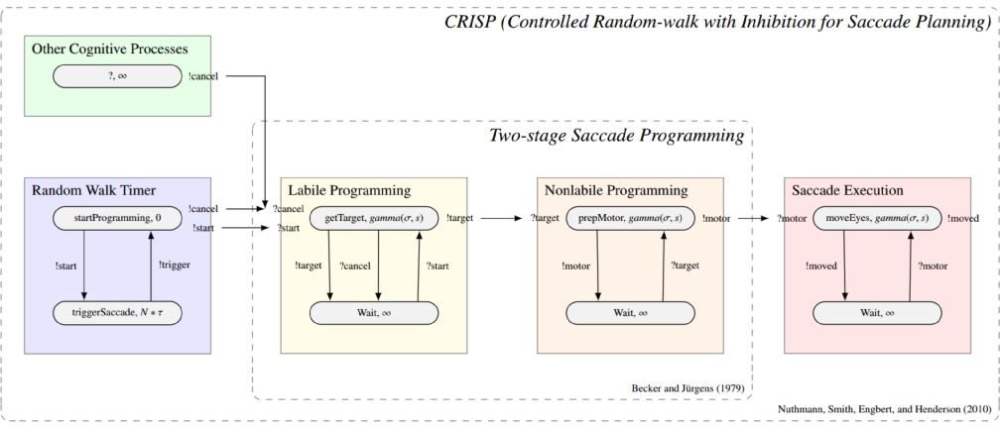 

https://github.com/RyanHope/PyeMovements/blob/master/crisp.py

https://simpy.readthedocs.org/en/latest

---

## CRISP control mechanisms

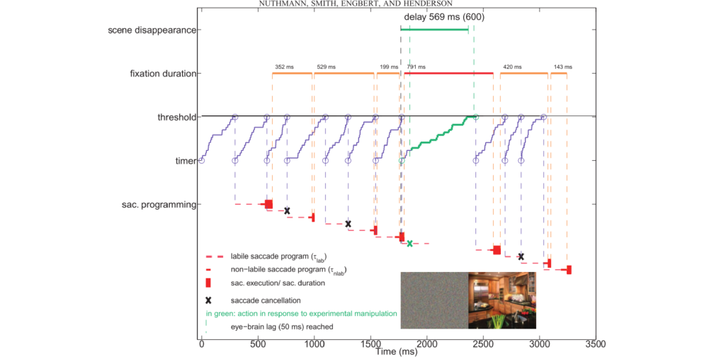 

--- .segue .dark .quote

## The Experiment

--- &twocol

## Mixed-block antisaccade task

*** =left 

+ 480 trials split by 12 blocks
    - 20 anti / 20 pro per block
+ Initially 23 subjects
    - Dropped 1 Sx, latencies were 1/2 that of all other Sxs
    - Dropped 4 Sxs, learned to do the task without eye movements
    - Dropped all trials with blinks

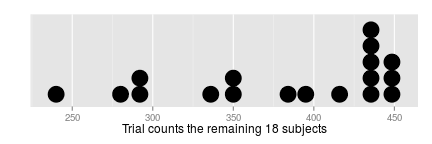 

*** =right

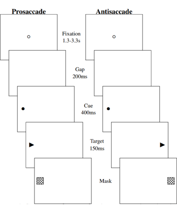 

---

## Eye movement parameters in the antisaccade task

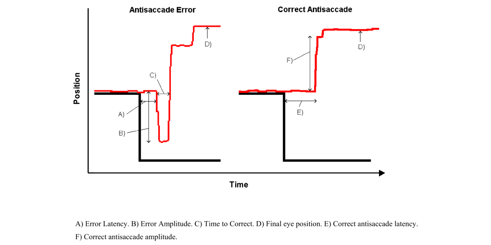 

--- .segue .dark .quote

## Experimental Results

---

## Task performance

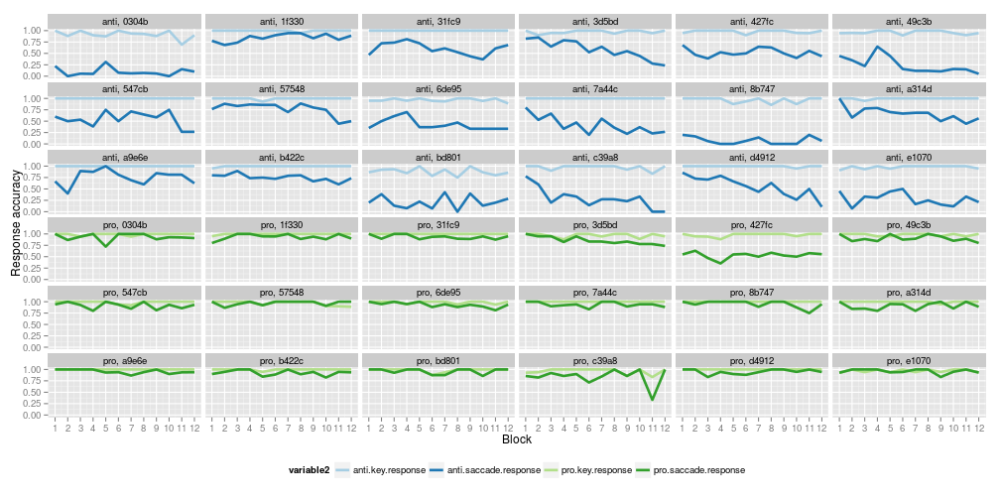 

---

## First saccade latency

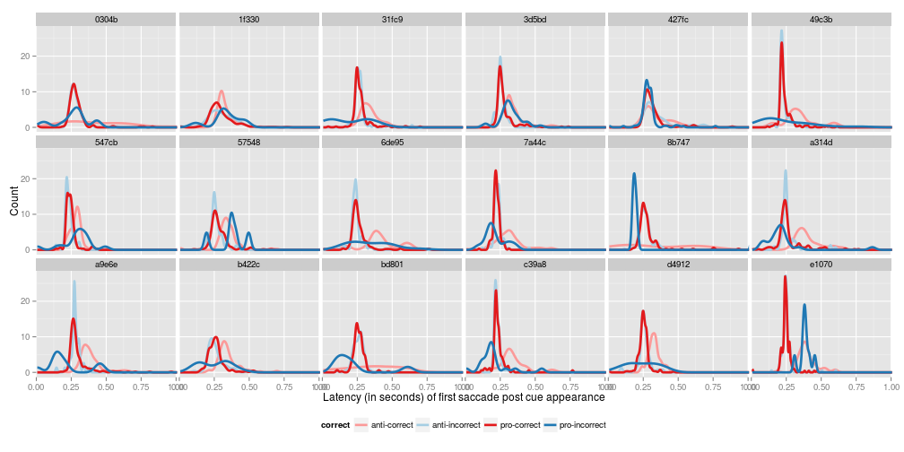 

---

## First saccade latency (subsetted)

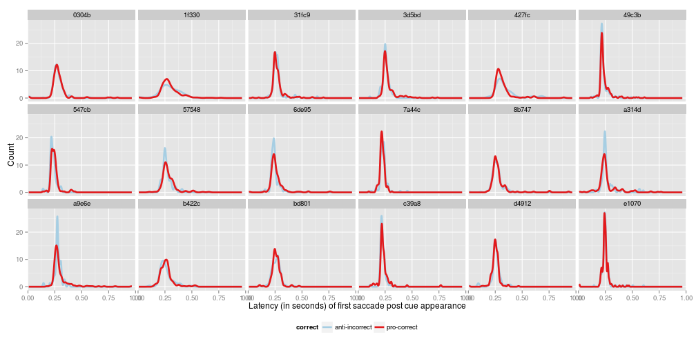 

---

## First saccade amplitude

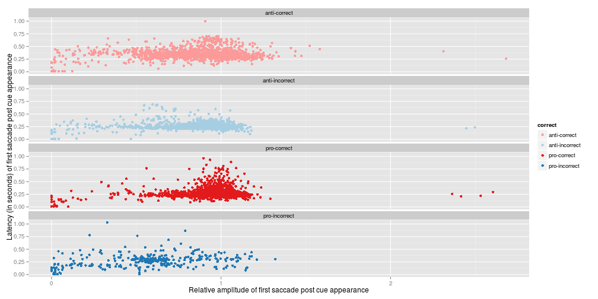 

--- .segue .dark .quote

## The Models

--- &twocol

## Model variants / task interaction

*** =left

Model 1: baseline
+ possible cancellation at gap
+ rate change at gap
+ possible cancellation at cue
+ rate change at cue
+ getTarget() always returns Inf

*** =right

Model 2: bottom-up
+ rate change at gap
+ rate change at cue
+ getTarget() queries environment module

Model 3: top-down
+ rate change at gap
+ attention shift at gap
+ rate change at cue
+ attention shift at cue
+ getTarget() queries attention module

---

## Model variant conceptual differences

+ <b>For the non-spatial (baseline) model, fixating is achieved via saccade cancellation.</b>

+ <b>For the spatial models, fixating is achieved via making a saccade of zero amplitude.</b>

--- &twocol

## Model: baseline | Timer rate

*** =left

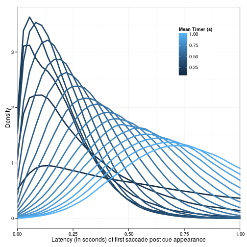 

*** =right

- The timer value seems to interact with the labile stage duration
 - When timer interval << labile duration, kurtosis <0, labile duration dominates mode
 - When timer interval ~= labile duration, kurtosis >0
 - When timer interval >> labile duration, kurtosis <0, timer interval dominates mode

---

## Model: baseline | Labile programming duration

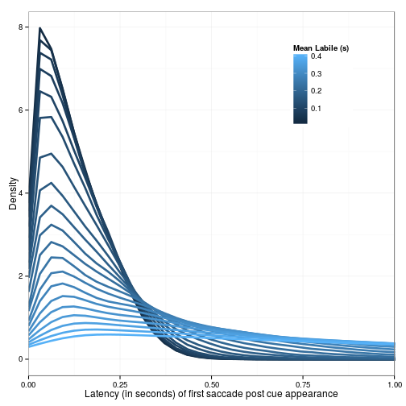 

---

## Model: baseline | Gap cancellation
 
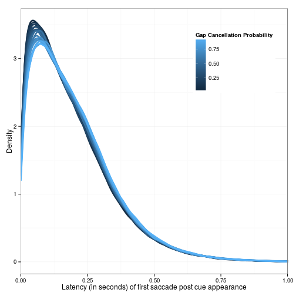 

---
 
## Model: baseline | Cue cancellation
 
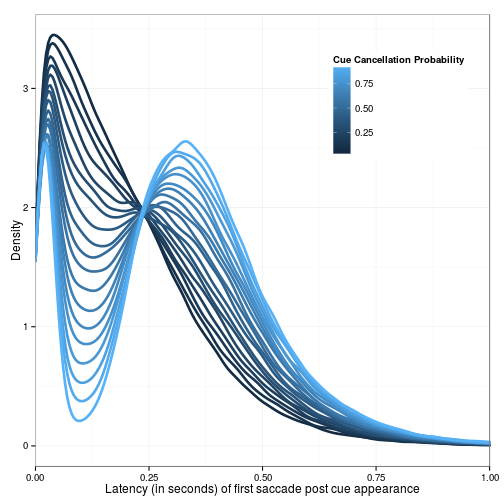 

---

## MindModeling@Home (Beta)

MindModeling@Home is volunteer computing pool dedicated to the advancement of cognitive science.

+ Based in Dayton, OH at:
    - The University of Dayton Research Institute
    - Wright State University
+ https://mindmodeling.org/
+ **Can run a year's worth of simulations in the matter of a few hours to a few days!**

Powered by:

 

---

## Parameter space

<table>
				<tbody><tr class="tableHead">
					<th>#</th>
					<th>Name</th>
					<th>Start</th>
					<th>Step</th>
					<th>Stop</th>
					<th>Count</th>
				</tr>
				<tr>
						<td>1.</td>
						<td>timer_states</td>
						<td>20</td>
						<td>40</td>
						<td>180</td>
						<td>5</td>
					</tr><tr>
						<td>2.</td>
						<td>timer_mean</td>
						<td>0.200</td>
						<td>0.025</td>
						<td>0.300</td> 
						<td>5					</td> 
					</tr><tr>
						<td>3.</td>
						<td>labile_mean</td>
						<td>0.120</td>
						<td>0.02</td>
						<td>0.180</td> 
						<td>4					</td> 
					</tr><tr>
						<td>4.</td>
						<td>labile_stdev</td>
						<td>8</td>
						<td>4</td>
						<td>16</td> 
						<td>3					</td> 
					</tr><tr>
						<td>5.</td>
						<td>attn_mean</td>
						<td>0.100</td>
						<td>0.025</td>
						<td>0.250</td> 
						<td>7					</td> 
					</tr><tr>
						<td>6.</td>
						<td>attn_stdev</td>
						<td>8</td>
						<td>4</td>
						<td>16</td> 
						<td>3					</td> 
					</tr><tr>
						<td>7.</td>
						<td>gap_cancel_prob</td>
						<td>0</td>
						<td>0</td>
						<td>0</td>
						<td>1</td>
					</tr><tr>
						<td>8.</td>
						<td>gap_timer_rate</td>
						<td>0.25</td>
						<td>0.25</td>
						<td>1.75</td> 
						<td>7					</td> 
					</tr><tr>
						<td>9.</td>
						<td>cue_cancel_prob</td>
						<td>0</td>
						<td>0</td>
						<td>0</td>
						<td>1</td>
					</tr><tr>
						<td>10.</td>
						<td>cue_timer_rate</td>
						<td>0.25</td>
						<td>0.25</td>
						<td>1.75</td> 
						<td>7					</td> 
					</tr><tr>
						<td>11.</td>
						<td>alpha</td>
						<td>0</td>
						<td>1</td>
						<td>1</td>
						<td>2</td>
									</tr>
			</tbody></table>

---

## Parameter space evaluation

"model run" = 500 trials

KS test = Kolmogorov–Smirnov test

+ One model run per parameter combination was dispatched out to volunteer computers
+ For each model run:
    - the resulting latency distribution (from the model) was compared to each of the 18 subjects data using a two-sample KS test
    - the two-sample KS test scores from each subject (as well as the evaluated parameter values) were returned to the MindModeling servers

+ For the following plots "best fitting" models were selected by picking the model with the lowest KS score

--- .segue .dark .quote

## MindModeling Result / Model Fits

---

## Trial Type: prosaccade | Model: bottom-up 

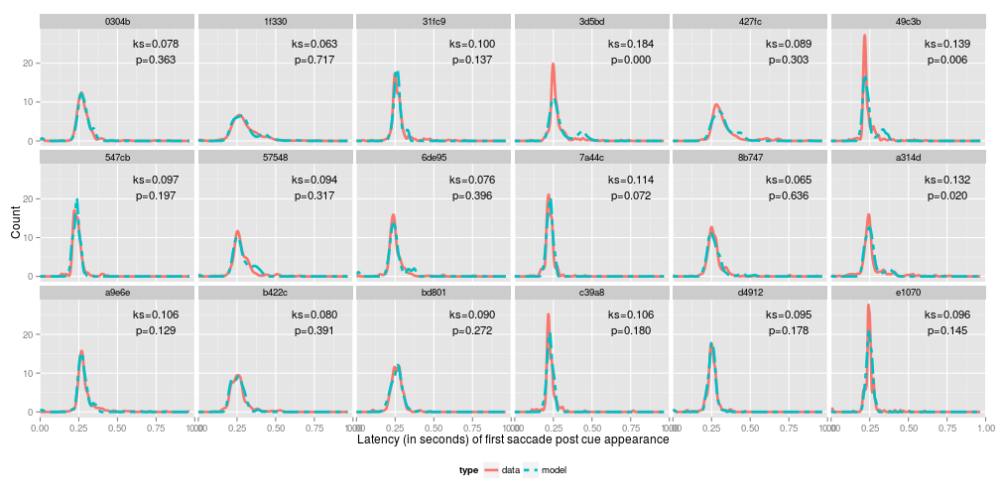 

---

## Trial Type: prosaccade | Model: top-down

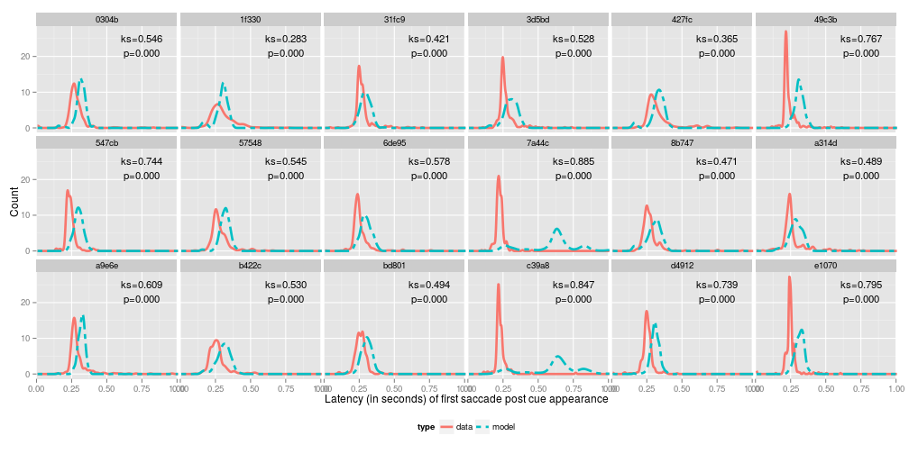 

---

## Trial Type: antisaccade | Model: bottom-up

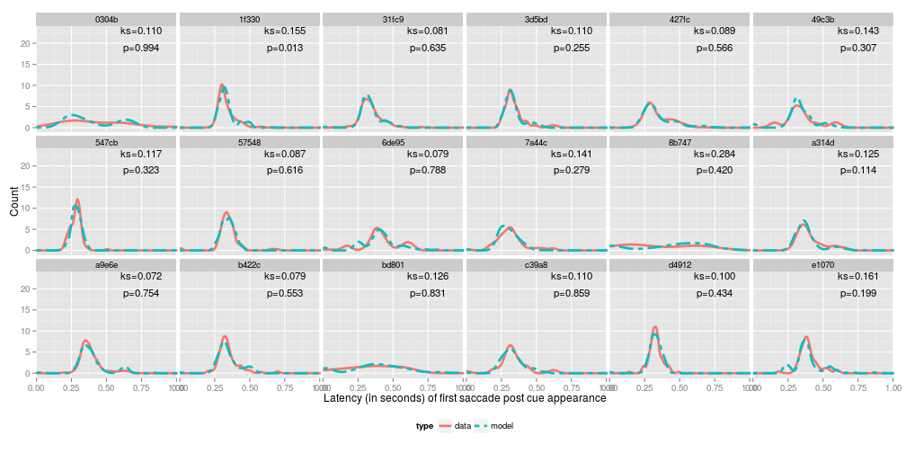 

---

## Trial Type: antisaccade | Model: top-down

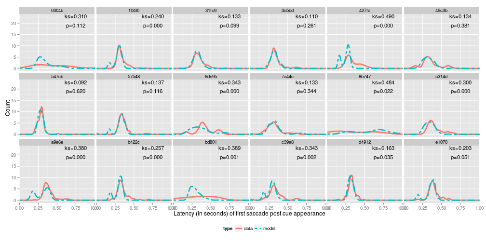 

--- .segue .dark .quote

## Summary

---

## Preliminary results and conclusions

Results
+ The baseline model fits nothing
+ The bottom-up model fits:
    - pro-correct trials very well
    - anti-incorrect trials very well
    - anti-correct trials very well
+ The top-down model fits:
    - anti-correct trials

Conclusions
+ Modeling results so far support the idea that voluntary control can emerge from an oculomotor control system based on automatic saccade timing
+ Saccade cancelation is not needed to "keep the eyes from moving" (i.e. maintain fixation)

---

## Limitations and continuing work

* A large space of parameters generate latency distributions that are statistically indistinguishable from human data
    - Need to understand what this means, if any parameters are not needed
    - Need to determine if any values can be fixed for all subjects
* Need to get model performing task as mixed block instead of single blocks
    - Need to see what if any parameters work for both anti and pro trials
* Need to improve model evaluation on volunteers
    - Need to perform more than one model run and get estimate of KS stat variance

* Haven't attempted to model saccade amplitude yet
* Haven't attempted to model the latency of saccades beyond the first saccade

--- .segue .dark .quote

## Any questions?

### Thank you for your time!
