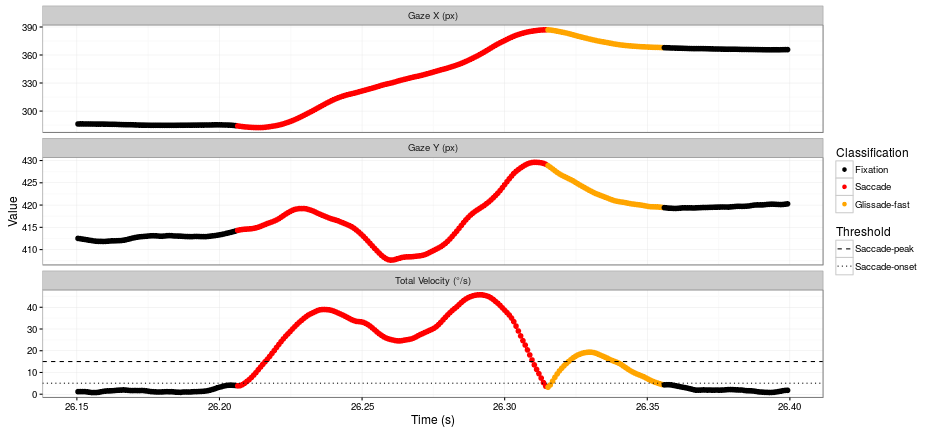
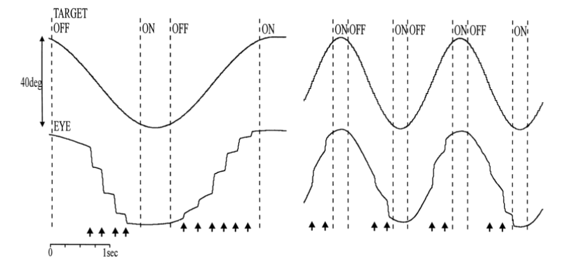
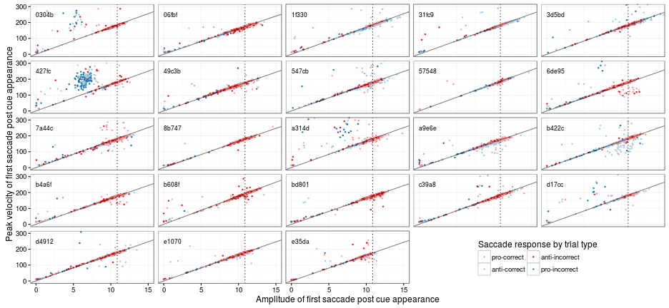
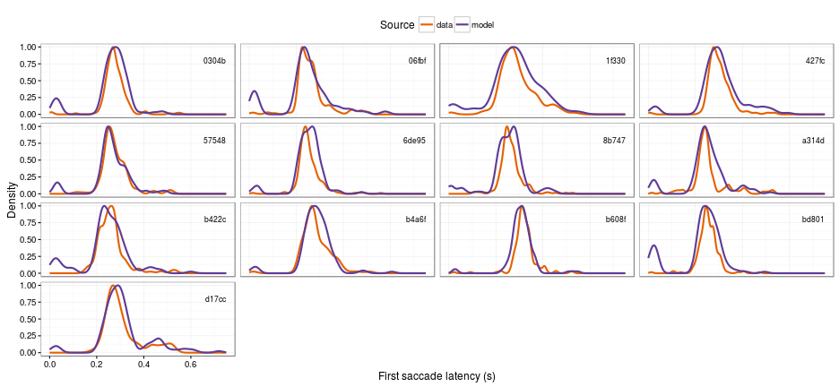
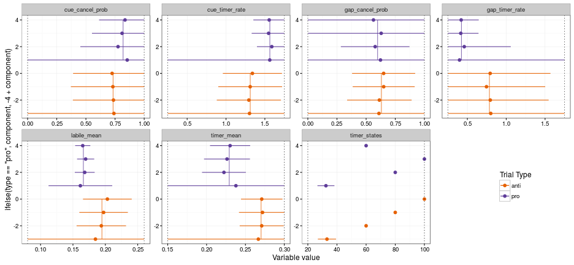
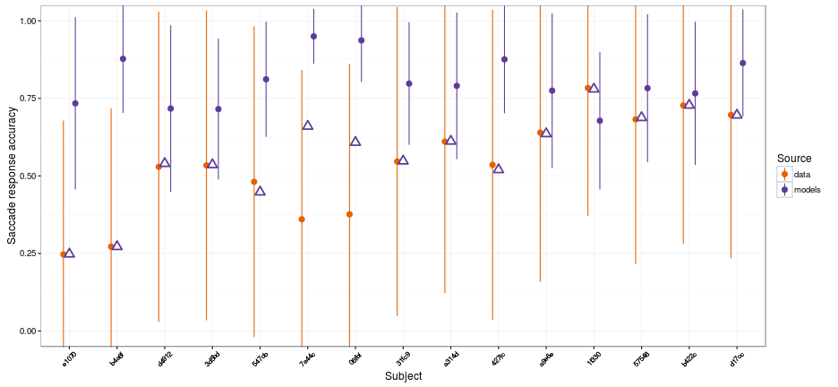
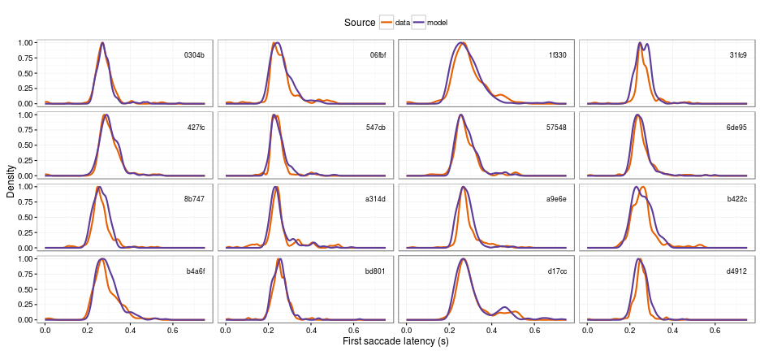
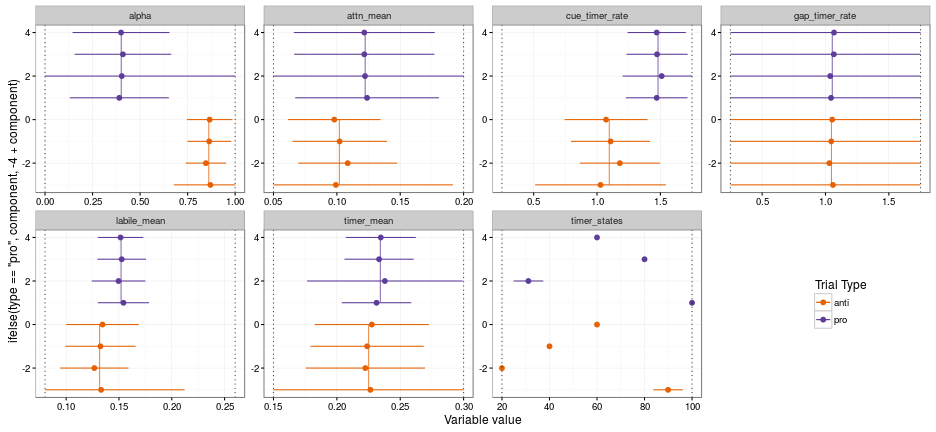

## Voluntary vs. involuntary eye movements

+ Humans make on average 1-4 saccades every second
    - thats 10s to 100s of thousands of saccades per day
    - how many are deliberately planned?
    
+ Humans feel like they can VOLUNTARILY move their eyes:
    - to any location
    - at any time
    
+ Certain circumstances absolutely INVOLUNTARILY saccades:
    - e.g. the sudden onset of a visual stimulus

---

## Evidence supporting automatic saccade timing

+ corrective eye movements (aka glissades)
    - short intersaccadic intervals
    - no intersaccadic interval
    - overlapping saccades

+ fixational eye movements (aka microsaccades)
    - reduce image fading from photoreceptor fatigue
    - possibly related to shifts of attention
    - follows main-sequence

+ smooth pursuit
    - lots of small regularly spaced unconscious saccades

---

## Short intersaccadic intervals

---

## Overlapping saccades and glissades

---

## Smooth pursuit

--- .segue .dark .quote

<ss>How does the sense of voluntary control emerge from an oculomotor control system based on automatic saccade timing?</ss>

---

## The (C)ontrolled (R)andom-walk with (I)nhibition for (S)accade (P)lanning model

---

## CRISP control mechanisms

---

## CRISP DEVS (Discrete Event System Specification)

https://github.com/RyanHope/PyeMovements/blob/master/crisp.py

https://simpy.readthedocs.org/en/latest

--- .segue .dark .quote

## The Experiment

--- &twocol

## Mixed-block antisaccade task

*** =left 

+ 23 subjects
+ 480 trials split by 12 blocks
    - 20 anti / 20 pro per block
    - Dropped all trials with blinks between fixation point offset
    and first saccade

*** =right

---

## Saccade response accuracy

---

## Saccade latency

---

## Saccade amplitude

---

## Main sequence

--- .segue .dark .quote

## Models \& Simulations

--- .segue .dark .quote

## Simulation 1

---

## Sim1 saccade latency (prosaccade trials)

---

## Sim1 saccade latency (antisaccade trials)

---

## Sim1 cluster analysis

--- .segue .dark .quote

## Simulation 2

---

## Sim2 saccade response accuracy

---

## Sim2 saccade latency (prosaccade trials)

---

## Sim2 saccade latency (antisaccade trials)

---

## Sim2 cluster analysis

